# NovusGate

[](https://github.com/Ali7Zeynalli/NovusGate/stargazers)
[](LICENSE)
[](https://www.wireguard.com/)
[](#-vpn-type)

🚀 **Build your own private VPN network — without SaaS lock-in or painful configurations.**

**NovusGate** is a modern, fully self-hosted **VPN control plane** built on top of the **WireGuard®** protocol.  
It allows you to securely connect servers, cloud instances, and personal devices using a clean **Hub-and-Spoke architecture**, all managed from a single web dashboard.

Whether you're running production infrastructure or simply want full ownership of your private network, **NovusGate gives you clarity, security, and control**.


---

## ⚠️ Important: What NovusGate Is (and Isn't)

**NovusGate is NOT a "hide my IP" or "bypass geo-restrictions" VPN.**

It is a **private network infrastructure tool** designed for:
- ✅ Secure server-to-server communication
- ✅ Remote access to internal services
- ✅ Connecting distributed infrastructure
- ✅ Building trusted private networks

**Traffic Routing:**
- Only traffic destined for your VPN subnets (e.g., `10.x.x.x`) goes through the tunnel
- Your regular internet traffic (YouTube, Google, etc.) goes directly through your ISP
- This is called **Split Tunneling** — efficient and purposeful

If you need a "full tunnel" VPN to hide all your traffic, NovusGate is not the right tool. Use commercial VPN services for that purpose.

---

## 🎯 The Problem NovusGate Solves

**Scenario:** You have a server somewhere (cloud, home, office) but:
- ❌ You don't have a static IP to connect to it
- ❌ You don't want to expose your server's IP directly to the internet
- ❌ NAT/Firewall makes direct connections impossible

**Solution with NovusGate:**

```
┌─────────────────┐     ┌─────────────────┐     ┌─────────────────┐
│   Your Server   │     │  NovusGate Hub  │     │  Your Computer  │
│   (No Static IP)│     │   (Cloud VPS)   │     │  (Home/Office)  │
│                 │     │                 │     │                 │
│   10.10.10.2    │───▶│   10.10.10.1    │◀───│   10.10.10.3    │
└─────────────────┘     └─────────────────┘     └─────────────────┘
         │                     ▲                     │
         └────────── Both connect to Hub ────────────┘
```

Once both devices connect to NovusGate:
- ✅ They see each other as if on the **same local network**
- ✅ Your server becomes `10.10.10.2` — always reachable
- ✅ Your computer becomes `10.10.10.3` — can SSH, RDP, or access any service
- ✅ No port forwarding needed
- ✅ No static IP required
- ✅ Works behind NAT, firewalls, anywhere

**Real-world example:**
```bash
# From your computer (10.10.10.3), connect to your server:
ssh user@10.10.10.2

# Access a web service running on your server:
curl http://10.10.10.2:8080
```

It's like having all your devices on the same LAN — no matter where they physically are.

---

## ✨ Why NovusGate?

Most private network solutions today are either:
- ❌ SaaS-based black boxes  
- ❌ Hard to manage at scale  
- ❌ Overkill for small teams  
- ❌ Or painful to self-host  

**NovusGate was built to be different.**

It focuses on:
- **Ownership over convenience**
- **Simplicity over complexity**
- **Transparency over abstraction**

You run it.  
You control it.  
Your network — your rules.

---

## 🚀 Key Features

- **Multi-Network Architecture**  
  Create multiple isolated VPN networks, each with its own WireGuard interface, subnet, and port.

- **Hub-and-Spoke Architecture**  
  Centralized control where all traffic is securely routed through your server.

- **Modern Web Dashboard**  
  Manage networks, nodes, inspect traffic, and control your VPN using a sleek React-based UI.

- **One-Click Installer**  
  Deploy and update NovusGate effortlessly using a dedicated Docker-based installer.

- **Safe & Smart Updates**  
  Upgrade your system without losing configuration or network state.

- **Secure by Default**  
  WireGuard cryptography, JWT authentication, and API key–based internal communication.

- **Multi-Platform Client Support**  
  QR codes for mobile, config downloads for desktop, one-line install scripts for Linux.

- **Server Monitoring Dashboard**  
  Real-time CPU, RAM, Disk usage and system uptime displayed on the main dashboard.

- **Fail2Ban Integration**  
  Built-in SSH brute-force protection with jail management, banned IP viewing, and one-click unban.

- **Firewall Management**  
  Comprehensive host firewall (iptables) and VPN inter-network firewall with traffic control between VPN networks.

- **Unified Network Overview**  
  Dashboard shows all networks combined with total statistics, plus per-network breakdown.

---

## 📡 VPN Type

**NovusGate is a Remote Access VPN with Client-Based Architecture.**

| VPN Type | NovusGate? | Description |
|----------|------------|-------------|
| ☁️ Cloud VPN | ⚠️ | Not a managed service like AWS/Azure VPN Gateway. NovusGate is self-hosted and can run on any cloud or on-premises |
| 🔐 IPsec VPN | ❌ | Uses WireGuard protocol instead of IPsec |
| 🌐 SSL VPN | ❌ | Not browser-based, requires WireGuard client |
| 💻 **Client-Based VPN** | ✅ | Requires WireGuard client software |
| 🏢 Site-to-Site VPN | ⚠️ | Possible via node-to-node connections |
| 📡 **Remote Access VPN** | ✅ | Primary use case |

**Key Characteristics:**
- **Protocol:** WireGuard (modern, fast, secure)
- **Architecture:** Hub-and-Spoke (centralized control)
- **Tunneling:** Encrypted trusted tunnel with Split Tunneling
- **Deployment:** Cloud-ready (any provider) or on-premises
- **Clients:** Mobile (QR), Desktop (.conf), Linux (scripts)

---

## 👥 Who is NovusGate for?

- **SysAdmins** managing secure access between servers and data centers  
- **DevOps Engineers** connecting infrastructure across environments  
- **Developers** building internal or self-hosted platforms  
- **Privacy-conscious users** who want full control over their VPN setup  

If you value **self-hosting, security, and simplicity**, NovusGate is for you.

---

## 🧠 How It Works (High-Level)

1. A **central server** acts as the control plane  
2. Create **isolated networks** with unique subnets (10.x.x.0/24)
3. Devices register and authenticate securely  
4. WireGuard tunnels are established automatically  
5. Traffic is routed securely through the control plane  

No hidden magic.  
No vendor lock-in.  
Just clean networking.

---

## 📂 System Architecture

NovusGate is designed as a **modular system**, separating control, interface, and deployment for maximum flexibility and maintainability.

```
┌────────────────────────────────────────────────────────────┐
│                     NovusGate Server                       │
│  ┌─────────────┐  ┌─────────────┐  ┌─────────────┐         │
│  │  Network 1  │  │  Network 2  │  │  Network N  │         │
│  │   wg0:51820 │  │   wg1:51821 │  │   wgN:518XX │         │
│  │ 10.10.0.0/24│  │ 10.20.0.0/24│  │ 10.XX.0.0/24│         │
│  └──────┬──────┘  └──────┬──────┘  └──────┬──────┘         │
│         │                │                │                │
│  ┌──────┴────────────────┴────────────────┴──────┐         │
│  │              REST API (Go Backend)            │         │
│  │                 PostgreSQL DB                 │         │
│  └───────────────────────────────────────────────┘         │
└────────────────────────────────────────────────────────────┘
                           │
              ┌────────────┼────────────┐
              │            │            │
         ┌────┴────┐  ┌────┴────┐  ┌────┴────┐
         │ Client  │  │ Client  │  │ Client  │
         │ (Phone) │  │ (Laptop)│  │ (Server)│
         └─────────┘  └─────────┘  └─────────┘
```

### 1. Server (Backend)
📁 `./server`

The core logic written in **Go**.  
Manages WireGuard interfaces, PostgreSQL database, and exposes the REST API.

- **Developer Guide:** `./server/DEVELOPER_GUIDE.md`  
- **User Guide:** `./server/USER_GUIDE.md`

---

### 2. Web Dashboard (Frontend)
📁 `./web`

Administrative interface built with **React**, **TypeScript**, and **Tailwind CSS**.

- **Developer Guide:** `./web/DEVELOPER_GUIDE.md`  
- **User Guide:** `./web/USER_GUIDE.md`

---

### 3. NovusGate Center
📁 `./installer`

A standalone **Node.js** tool that simplifies deployment on Linux servers via SSH.

- **Developer Guide:** `./installer/DEVELOPER_GUIDE.md`  
- **User Guide:** `./installer/USER_GUIDE.md`

---

> 🇦🇿 **Azərbaycan Dilində**  
> Layihənin əsas sənədlərini Azərbaycan dilində oxumaq üçün  
> 👉 **[README_AZ.md](./README_AZ.md)**

---

## ⚡ Quick Start

### Prerequisites

**On your local computer:**
- Docker & Docker Compose installed

**On your remote server:**
- Linux server (Ubuntu 20.04 / 22.04 recommended)
- SSH access with root or sudo privileges
- Open ports: 22 (SSH), 51820+ (UDP for WireGuard), 8080 (API)

---

### Installation Process (Step-by-Step)

> **Note:** This process launches the **NovusGate Center**, a web-based wizard that will guide you through setting up the server, database, and VPN configurations.

#### Step 1: Clone the Repository

```bash
git clone https://github.com/Ali7Zeynalli/NovusGate.git
cd NovusGate
```

#### Step 2: Start NovusGate Center

```bash
cd "NovusGate Center"
docker-compose up -d --build
```

#### Step 3: Open NovusGate Center Web Interface

Open your browser and go to:
```
http://localhost:3017
```

#### Step 4: Connect to Your Remote Server

In the installer interface, enter your server credentials:

| Field | Description |
|-------|-------------|
| **Host** | Your server's IP address (e.g., `203.0.113.50`) |
| **Port** | SSH port (default: `22`) |
| **Username** | SSH username (e.g., `root` or `ubuntu`) |
| **Password** | SSH password or use SSH key |

Click **Connect** to establish SSH connection.

#### Step 5: Configure Installation

After connecting, configure the installation settings:

| Setting | Description |
|---------|-------------|
| **Admin Username** | Dashboard login username (default: `admin`) |
| **Admin Password** | Dashboard login password (auto-generated or custom) |
| **Server Endpoint** | Your server's public IP for VPN connections |
| **Admin CIDR** | Admin network subnet (default: `10.99.0.0/24`) |
| **API Key** | Internal API security key (auto-generated) |

#### Step 6: Start Installation

Click **Install NovusGate Server** button.

The installer will:
1. ✅ Update system packages
2. ✅ Install Docker & Docker Compose
3. ✅ Install WireGuard
4. ✅ Install Fail2Ban (SSH protection)
5. ✅ Clone NovusGate repository
6. ✅ Configure environment variables
7. ✅ Build and start Docker containers
8. ✅ Create Admin VPN network
9. ✅ Generate admin VPN configuration

#### Step 7: Save Your Credentials

After installation completes, the installer will display:

```
╔════════════════════════════════════════════╗
║         INSTALLATION COMPLETE!             ║
╠════════════════════════════════════════════╣
║  Admin Username: admin                     ║
║  Admin Password: xxxxxxxxxxxxxxxx          ║
║                                            ║
║  Dashboard URL: https://10.99.0.1:3007     ║
║  (Accessible only via VPN)                 ║
╚════════════════════════════════════════════╝
```

⚠️ **IMPORTANT:** Save these credentials immediately! They won't be shown again.

#### Step 8: Download Admin VPN Config

The installer provides your admin VPN configuration:
- **QR Code** - Scan with WireGuard mobile app
- **Download .conf** - For desktop WireGuard client
- **Copy Config** - Manual configuration

#### Step 9: Connect to Admin VPN

1. Install WireGuard client on your device
2. Import the admin configuration
3. Activate the VPN connection
4. Verify connection (you should get IP like `10.99.0.2`)

#### Step 10: Access the Dashboard

Once connected to VPN, open:
```
https://10.99.0.1:3007
```

Login with your admin credentials from Step 7.

🎉 **Congratulations!** NovusGate is now installed and ready to use.

---

### Post-Installation

After accessing the dashboard, you can:
- Create additional VPN networks
- Add nodes/clients to networks
- Monitor server resources
- Manage Fail2Ban security
- View traffic statistics

---

### Technical Details: What does NovusGate Center do?

The installer automates the setup on your remote Linux server. Here is exactly what happens under the hood:

1.  **System Updates**: Runs `apt-get update` to ensure fresh packages.
2.  **Dependencies**: Installs `docker`, `docker-compose`, `wireguard`, and `fail2ban`.
3.  **File Placement**:
    -   Installation Directory: `/opt/NovusGate`
    -   Admin VPN Config: `/opt/NovusGate/admin-vpn.conf`
4.  **Security Setup**:
    -   Generates secure random secrets for Database, JWT, and API Keys.
    -   Configures `fail2ban` jail for SSH protection.
    -   Sets up `wg0` WireGuard interface for the Admin Network.
5.  **Service Startup**:
    -   Creates `.env` files in `/opt/NovusGate/server/deployments/docker/` and `/opt/NovusGate/web/`.
    -   Launches services using `docker-compose up -d`.

This ensures a standardized, secure, and production-ready environment without manual configuration.

---

### Local Development / Manual Run

If you want to run NovusGate locally (without the Installer wizard) for development or testing:

1. Navigate to the docker deployment directory:
   ```bash
   cd server/deployments/docker
   ```

3.  **Configure Environment**:
    ```bash
    cp .env.example .env
    # Edit .env and set ADMIN_PASSWORD at minimum
    nano .env
    ```

4.  **Start the services**:
    ```bash
    docker-compose up -d --build
    ```

   This will start:
   - **PostgreSQL** (Database)
   - **Control Plane** (Backend API on port 8080)
   - **Web Dashboard** (Frontend on port 3007)

3. Access the dashboard at `http://localhost:3007`

> **Note:** For full VPN functionality, this requires a Linux environment with WireGuard kernel modules. On Windows/Mac, some VPN features may be limited, but the UI and API will function.

---

### Manual Production Installation

For advanced users who prefer manual setup on a production server, refer to:
👉 **[Server User Guide](./server/USER_GUIDE.md)**

---

## 🌐 Network Management

NovusGate supports **multiple isolated networks**:

| Feature | Description |
|---------|-------------|
| **Isolated Subnets** | Each network has its own CIDR (e.g., 10.10.0.0/24, 10.20.0.0/24) |
| **Dedicated Interfaces** | Automatic WireGuard interface allocation (wg0, wg1, wg2...) |
| **Unique Ports** | Each network listens on a different UDP port (51820, 51821...) |
| **Independent Nodes** | Nodes belong to specific networks and are isolated from others |

### Creating a Network

1. Go to **Networks** page in the dashboard
2. Click **Create Network**
3. Enter a name and CIDR range (e.g., `10.50.0.0/24`)
4. The system automatically assigns interface and port

---

## 🛡️ Security Notes

* Installer generates **unique credentials** — save them immediately
* Ensure UDP ports **51820+** are open (one per network)
* Admin dashboard is **hidden behind VPN** by default
* For production use, run the Web Dashboard behind **Nginx or Caddy with SSL**
* **Fail2Ban** is automatically installed and configured to protect SSH (3 failed attempts = 1 hour ban)

Security is not optional — it's the default.

---

## 📊 Server Monitoring

NovusGate includes built-in server monitoring:

| Metric | Description |
|--------|-------------|
| **CPU Usage** | Real-time processor utilization percentage |
| **RAM Usage** | Memory consumption with used/total display |
| **Disk Usage** | Storage utilization for the root partition |
| **Uptime** | Server running time since last boot |

All metrics are displayed on the main Dashboard and refresh automatically.

---

## 🔒 Fail2Ban Management

Protect your server from brute-force attacks:

| Feature | Description |
|---------|-------------|
| **Jail Status** | View active jails (SSH, etc.) and their configuration |
| **Banned IPs** | See currently banned IP addresses per jail |
| **Ban Statistics** | Total bans, current bans, failed attempts |
| **One-Click Unban** | Instantly unban IP addresses from the web interface |
| **Log Viewer** | Browse Fail2Ban logs with action filtering |

Access via **Security → Fail2Ban** in the dashboard.

---

## 🔥 Firewall Management

NovusGate includes a comprehensive firewall management system:

### Host Firewall (iptables)

| Feature | Description |
|---------|-------------|
| **Open Ports** | View and manage open ports on the server |
| **Block IPs** | Block specific IP addresses or CIDR ranges |
| **Allow IPs** | Whitelist trusted IP addresses |
| **Chain Management** | View INPUT, OUTPUT, FORWARD chain rules |
| **Protected Ports** | SSH, WireGuard, and API ports are protected from accidental closure |
| **Export Rules** | Download current firewall rules for backup |
| **Reset Firewall** | Restore default NovusGate firewall configuration |

### VPN Firewall (Inter-Network Rules)

Control traffic flow between VPN networks:

| Feature | Description |
|---------|-------------|
| **Network-to-Network Rules** | Allow or block traffic between different VPN networks |
| **Node-Specific Rules** | Create rules for specific nodes |
| **Protocol Filtering** | Filter by TCP, UDP, ICMP, or all protocols |
| **Port-Based Rules** | Allow/block specific ports or port ranges |
| **Priority System** | Rules are processed in priority order (lower = higher priority) |
| **Auto AllowedIPs** | Client configs automatically include permitted destination networks |

**How VPN Firewall Works:**
```
┌─────────────┐     ┌─────────────────┐     ┌─────────────┐
│ Source Node │ ──► │   VPN Server    │ ──► │ Dest Node   │
│ (10.10.0.2) │     │ FORWARD chain   │     │ (10.20.0.5) │
└─────────────┘     │ VPN Rules apply │     └─────────────┘
                    └─────────────────┘
```

All VPN traffic flows through the server. VPN firewall rules control the server's FORWARD chain, determining which traffic can be forwarded between networks.

**Example Use Cases:**
- Allow office network (10.10.0.0/24) to access admin panel (10.99.0.1)
- Block development network from accessing production servers
- Allow only HTTP/HTTPS traffic between specific networks
- Isolate guest network from internal resources

Access via **Firewall** page in the dashboard.

---

## 📸 Screenshots

### Web Dashboard
<div style="display: flex; flex-wrap: wrap; gap: 10px;">
  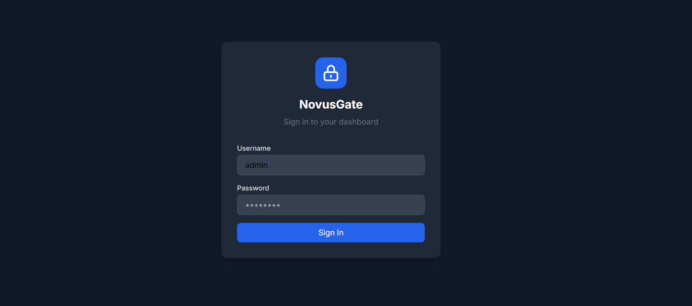
  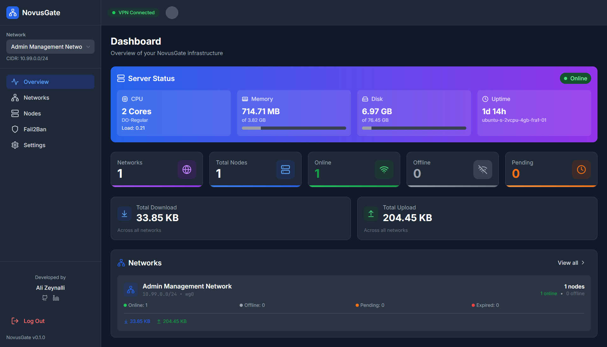
  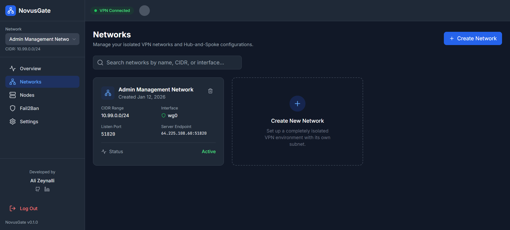
  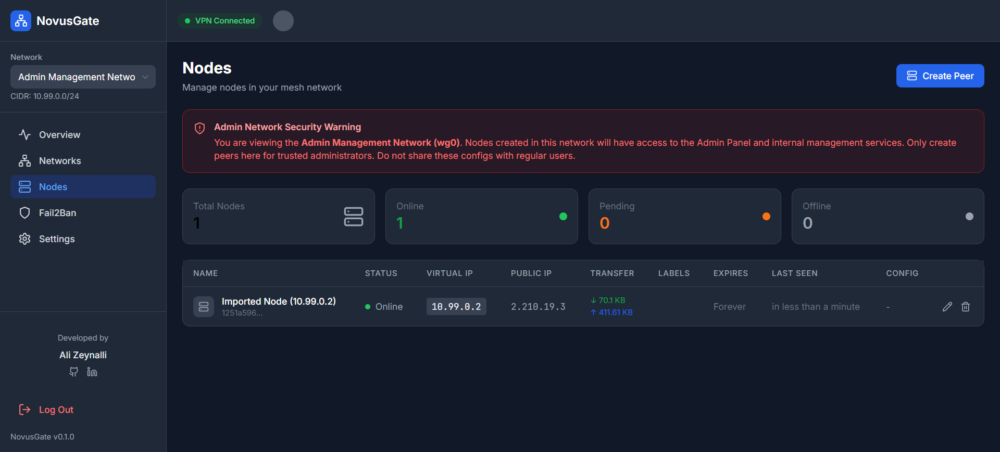
  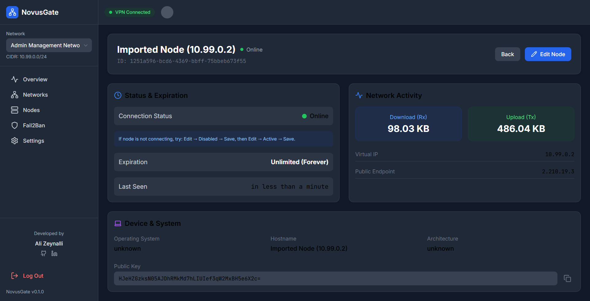
  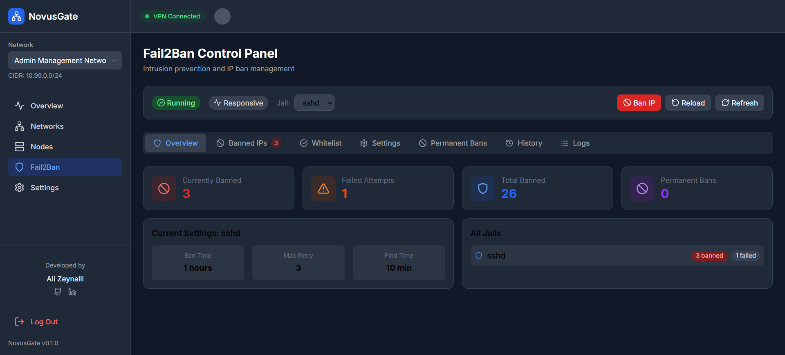
  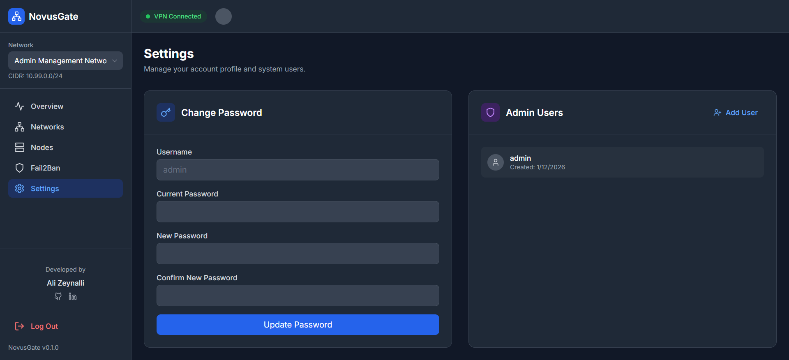
  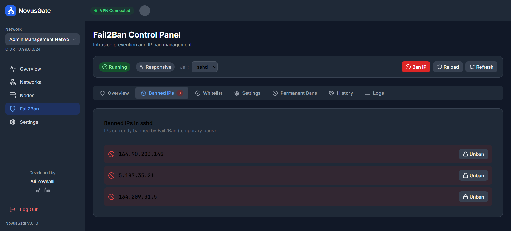
  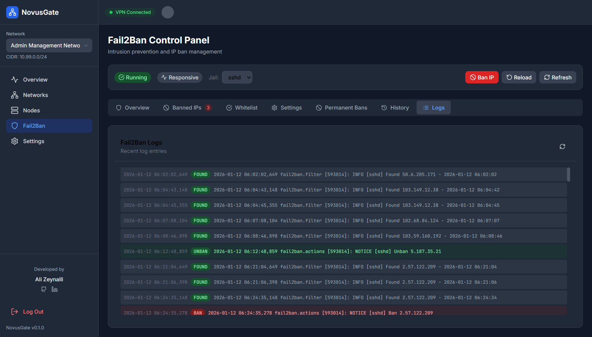
  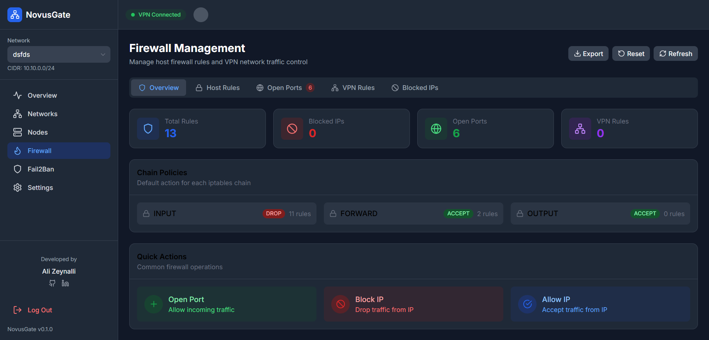
  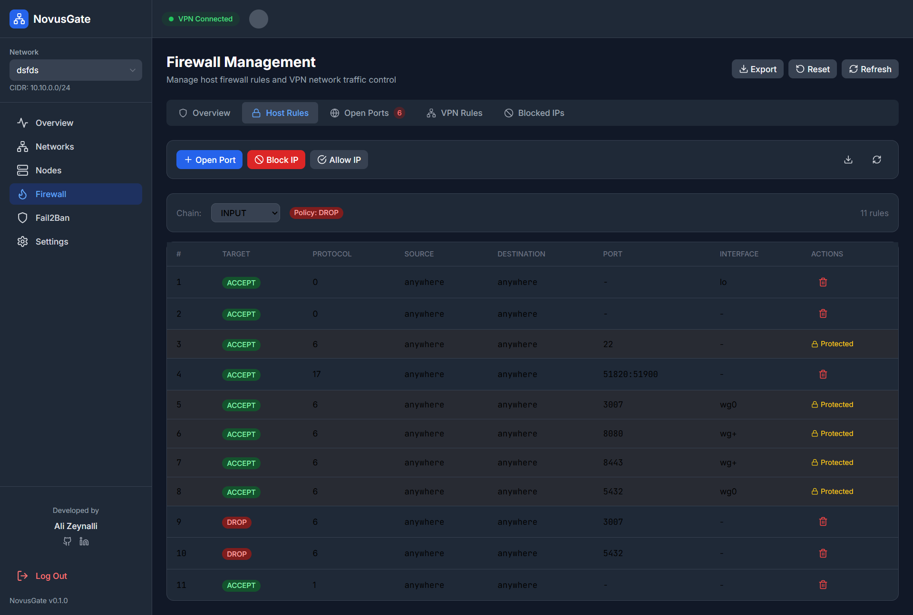
  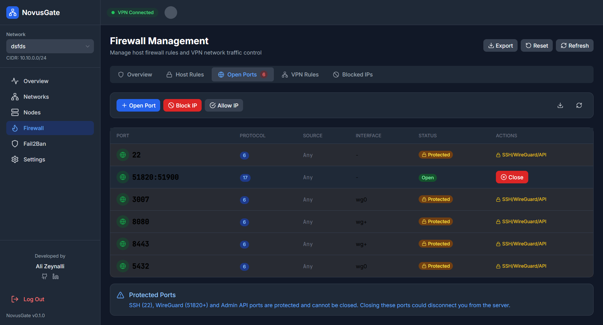
  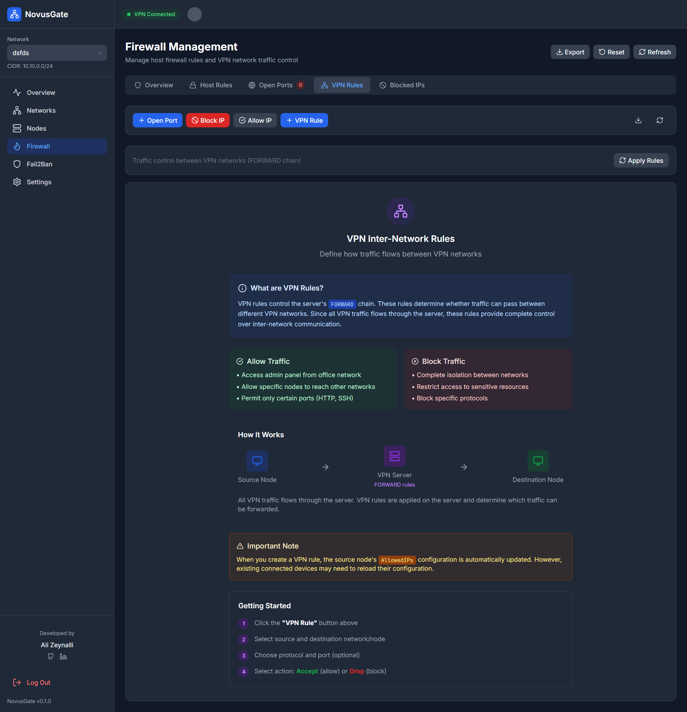
</div>

### NovusGate Center Interface
<div style="display: flex; flex-wrap: wrap; gap: 10px;">
  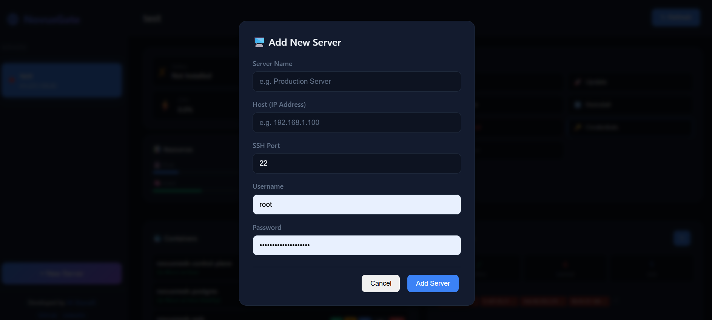
  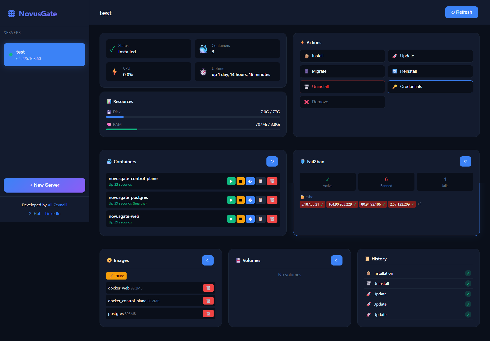
  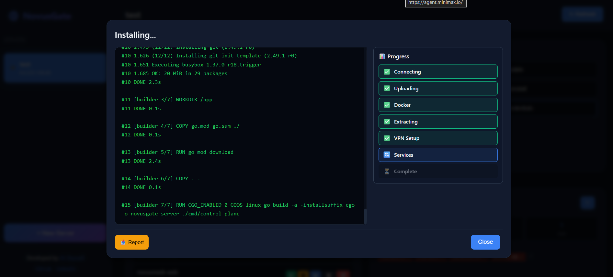
  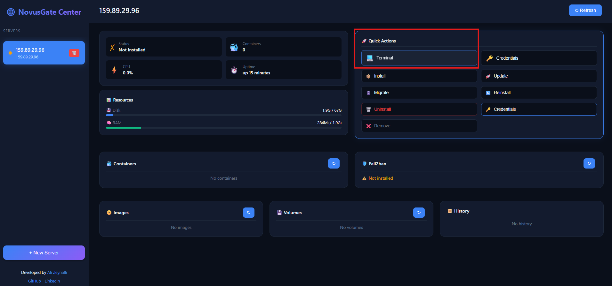
  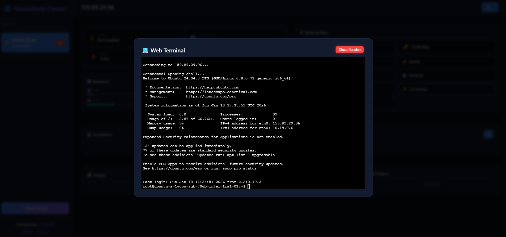
</div>

---

## 🤝 Contributing

Contributions are welcome ❤️
Bug reports, feature requests, and pull requests are highly appreciated.

Please read the **Developer Guides** before contributing.

---

## ⭐ Support the Project

If you find **NovusGate** useful:

* ⭐ Star the repository
* 🐛 Open issues
* 💡 Suggest features
* 📣 Share it with others

Open-source lives through community.

---

## 🤝 Professional Support / Enterprise Support

> **Finding installation difficult?** We can help!

If you cannot perform the steps shown in this guide yourself or need full enterprise-level support, you can contact us:

### Paid Services

| Service | Description |
|---------|-------------|
| 🛠️ **Full Installation** | Complete installation of NovusGate in your infrastructure |
| 🔧 **Server Configuration** | Linux, Docker, Firewall and Security configuration |
| 📞 **Technical Support** | Problem resolution and ongoing support |
| 📚 **Training** | NovusGate usage training for your team |

> 💰 **Pricing**: Service fees are calculated individually based on the scope and complexity of work. Contact us for a free consultation.

### Contact

📧 **Email**: Ali.Z.Zeynalli@gmail.com  
💼 **LinkedIn**: [linkedin.com/in/ali7zeynalli](https://linkedin.com/in/ali7zeynalli)  
📱 **Phone**: +49 152 2209 4631 (WhatsApp)

> 💼 SLA (Service Level Agreement) support is available for enterprise customers.

### 🌍 Supported Languages

| Language | Dil |
|----------|-----|
| 🇦🇿 Azerbaijani | Azərbaycan |
| 🇬🇧 English | İngilis |
| 🇩🇪 German | Alman |
| 🇷🇺 Russian | Rus |
| 🇹🇷 Turkish | Türk |

---

## 📄 License

This project is licensed under the **Apache License 2.0** - see the [LICENSE](LICENSE) file for details.

**© 2025 Ali Zeynalli**

The Apache 2.0 License allows you to:
- ✅ Use the software for any purpose (including commercial)
- ✅ Modify and distribute the software
- ✅ Use patent claims of contributors

While requiring you to:
- 📋 Include the original copyright notice
- 📋 Include the LICENSE and NOTICE files
- 📋 State significant changes made to the software
- � Provide attribution to the original author

> 📜 See [NOTICE](NOTICE) file for attribution requirements.

---

**Developed by [Ali Zeynalli](https://github.com/Ali7Zeynalli)**  
*Project NovusGate*
